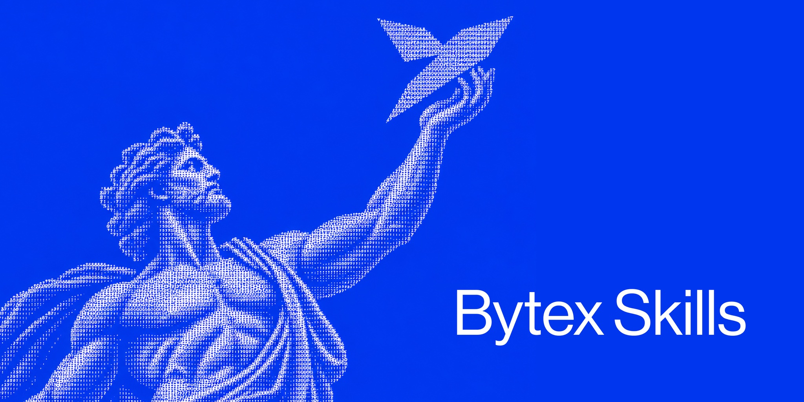

  

# BYTEX Skills

> These skills drive **[BYTEX](https://github.com/BYTEX-TRADE/bytex)**, an open-source event-driven trading engine for .NET. If they help you, star the engine repo: that is where the work happens.

A skill that lets an AI assistant work with the [BYTEX](https://github.com/BYTEX-TRADE/bytex) trading engine straight from a chat: read the repository, write a strategy, pull market data from eight venues, backtest it, search its parameters, and run it on paper against live exchange data.

There is one skill, [`bytex-trading-engine/`](bytex-trading-engine/), and it is the same for every assistant. Each assistant has its own install notes in [`install/`](install/), following that vendor's documentation.

## Format

The skill follows the open Agent Skills format that every assistant listed here documents: a folder named after the skill, a `SKILL.md` with only `name` and `description` in its YAML frontmatter, a short body that routes to `references/*.md`, and reference files one level deep. The same folder loads in Claude Code, Codex, Gemini CLI, Qwen Code, Kimi Code, Grok Build, ZCode and DeepSeek Harness.

## Install

| Assistant | Install notes |
|---|---|
| Claude Opus | [install/Claude_Opus.md](install/Claude_Opus.md) |
| ChatGPT Astra | [install/ChatGPT_Astra.md](install/ChatGPT_Astra.md) |
| Gemini Flash | [install/Gemini_Flash.md](install/Gemini_Flash.md) |
| Qwen | [install/Qwen.md](install/Qwen.md) |
| Kimi | [install/Kimi.md](install/Kimi.md) |
| Grok Code | [install/Grok_Code.md](install/Grok_Code.md) |
| GLM | [install/GLM.md](install/GLM.md) |
| DeepSeek V4 Pro | [install/DeepSeek_V4_Pro.md](install/DeepSeek_V4_Pro.md) |

In short: copy `bytex-trading-engine/` into the assistant's skills directory (`~/.claude/skills/`, `~/.agents/skills/`, `~/.gemini/skills/`, `~/.qwen/skills/`, `~/.kimi-code/skills/`, `~/.grok/skills/`, `~/.zcode/skills/`). In a chat app without a shell, the assistant gives you the commands and works from the output you paste back.

The skill clones the engine and runs its CLI, so the machine needs `git` and the .NET 10 SDK.

## What the skill covers

Written against BYTEX 0.11.0, with v2 market/candle identities, document schema
2.0 and manifest-backed archives. Older Engine releases do not support these
contracts. See [migration and recovery](bytex-trading-engine/references/migration.md)
for explicit conversion of legacy data and documents; preserve the originals.

| Topic | What the assistant can do with it |
|---|---|
| Repository map | explain what each project does, every CLI command, and how data, the archive, the trading runtime and the adapters fit together |
| Create a strategy | turn a strategy described in words into a validated JSON strategy document (88 node types, tick evaluation, leverage) |
| Get data | load instruments, bars and funding from any of the eight venues into a catalog, import exchange CSV files, check and repair a catalog |
| Backtest a strategy | run a backtest with the venue simulated as needed (fees, margin, liquidation, funding, bar path) and read the report and tearsheet |
| Backtesting beyond one run | sweeps, parameter sets, guided parameter search, walk-forward, several periods and instruments |
| Sandbox | run a strategy on live market data with simulated fills matched against the venue's book, with risk limits, a control channel and strategies added while the node runs |
| Venues | Binance, Bybit, KuCoin, OKX, Kraken, Bitget, Gate and Hyperliquid: families, configuration, keys, leverage, broker ids, limits |
| Adapters and connectors | how a client is configured and checked, Redis and object storage, key verification, where to start a new adapter |
| Tardis.dev and Databento | historical ticks, book deltas, trades, quotes and bars from the two data vendors |

## Safety

The skill never places real orders on its own. Live trading requires an explicit request in the same conversation, a trade-only API key kept in an env file, a run on paper first (BYTEX has no venue testnets: paper trading is the rehearsal), and loss and exposure limits on the command. Nothing here is investment advice.

## License

Apache-2.0, same as the engine. See [LICENSE](LICENSE).
